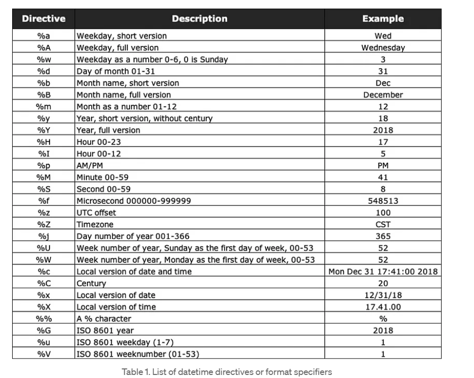

study of organizing data efficiently
Data structures manage how data is stored and accessed, while algorithms focus on processing this data

```python
n % 2 == 0 [ # Even No check]
n & 1 == 0 [ # Even No Check]
n == ( n >> 1 ) << 1 [ # For Even Check]

a, b = b, a [ # Swap numbers]

7 - n [opposite of dice]

n * ( n + 1 ) // 2 [sum of nth natural numbers]

d = arr[i] - arr[i - 1] [difference in AP]

n = n % 10 -> Extract the last digit

n //= 10 -> Remove the last digit

for i in range(n, n):  # Empty range , Loops doesn't execute here
	if n % i == 0:
		return False
```

# Check divisibility from 2 to the square root of n

```python
for i in range(2, int(math.sqrt(n)) + 1):  [ # + 1 we are check for all the value upto n]
	if n % i == 0:
		return False

check if y is a power of x
if x == 1:
	return True
pow = 1
while pow < y:
	pow = pow * x
return pow == y

append 0 in 2 D matrix -> [[0 for i in range(cols)] for j in range(rows)]
append 0 in 1 D matrix -> [0 for i in range(N)]


d.setdefault("key", value) "if value already present than no change"
							if value not present add it to dictionary

d.get(key, default_value)

curr = head
while curr.next:		# Traverse to last Node
	curr = curr.next

temp = Node(x)
curr.next = temp
return head

return (((x2 - x1)**2 + (y2 - y1)**2)**0.5)  # The distance between 2 points

if (a + b <= c) or (a + c <= b) or (b + c <= a) : return False else: return True  # Valid Triangle
res = 1
for i in range(n+1):res *= i  # Factorial of a number
```

# insert at beg

```python
temp = Node(x)
temp.next = head
head = temp
return head
```

# insert at end

```python
temp = Node(x)
if head is None:
	return Node(x)
curr = head
while curr.next:
	curr = curr.next
curr.next = temp
return head
```

# insert at specific position

```python
if pos < 1:
	print("Invalid") return head
if pos == 1:
	temp = Node(x)
	temp.next = head
	return temp
count = 0
curr = head
while curr:				# when not traversing till last node,  always use while curr:
	count += 1
	if count == k - 1:
		temp = Node(x)
		temp.next = curr.next
		curr.next = temp
		break
	curr = curr.next
return head
```

#SQLNotes
sub query

---

sub query in select statement should return only 1 row
sub query in From statement act as a temporary or subset of table
sub query in where statement acts as a filter query -> can return 1 row or multiple row

```SQL
CREATE VIEW view1 AS
	SELECT roll_no, name, subject FROM student;  # A Virtual table, selecting only a specific set of data.

SELECT * FROM view1;
```

Recursion-> function calling itself, stop only after hitting a Base Condition.

### Tower of Hanoi

```python
def toh(n, fromm, to, aux):
	if n == 0:
		return 0
	if n == 1:
		return 1
	x = toh(n - 1, fromm, aux, to)
	y = toh(n - 1, aux , to, fromm)
	return x + y + 1
```

### sqrt

```
res = 1
while res * res <= n:
	res += 1
return res - 1
```

### SQL LIKE OPERATOR

- The percent sign `%` represents zero, one, or multiple characters
- The underscore sign `_` represents one, single character

```SQL
SELECT _column1, column2, ..._
FROM _table_name_
WHERE _columnN_ LIKE _pattern_;

```

- You can also combine any number of conditions using `AND` or `OR` operators.
- Any wildcard, like `%` and `_` , can be used in combination with other wildcards.

### Python Datetime

```python
from datetime import datetime # Import datetime class.

current_time = datetime.now() # Get current date and time.

print("Current Date and Time:", current_time) # Display current date and time.

hour = current_time.hour # Extract the hour component from current_time.
minute = current_time.minute # Extract the minute component from current_time.
second = current_time.second # Extract the second component from current_time.
year = current_time.year
similary we can get month and day

# Display the extracted time components.
print(f"Hour: {hour}, Minute: {minute}, Second: {second}")

# Format current_time as "HH:MM:SS".
formatted_time = current_time.strftime("%H:%M:%S")

# Display the formatted time.
print("Formatted Time:", formatted_time)

formatted_time = current_time.strftime("%S:%M:%H") # seconds, minutes, hours
print("Formatted Time:", formatted_time)

from datetime import timedelta # Import timedelta class.

# Add one hour to current_time.
one_hour_later = current_time + timedelta(hours=1)

print("One hour later:", one_hour_later) # Display the time one hour later.

x = datetime.datetime(2023, 12, 6, 19, 39, 46)
print(x.strftime("%A, %d %b %Y, %I:%M:%S %p"))

#Output
Wednesday, 06 Dec 2023, 07:39:46 PM

current_date = datetime.date.today()
print(‘Today\’s date is – ‘, current_date.strftime(‘%d/%m/%Y’))

Output -
---Today’s date is – 03/08/2022

date_june = '25 Dec, 20'
date_june_converted = datetime.datetime.strptime(date_june, '%d %b, %y')
print('Date from the String format of date is - ', date_june_converted)

Output -
Date from the String format of date is - 2020-12-25 00:00:00

Note : strptime method -> map string date data type to date data type
strftime()” function to convert datetime into string format


```



### Example code of datetime module

```python
import time
from datetime import datetime, date, time as dt_time, timedelta
import pytz

# 1. Getting the Current Date and Time
def current_date_time():
    now = datetime.now()
    print("Current Date and Time:", now)
    print("Today's Date:", now.date())
    print("Current Time:", now.time())

# 2. Creating Specific Dates and Times
def create_specific_datetime():
    my_date = date(2025, 1, 18)  # (year, month, day)
    my_time = dt_time(14, 30, 45)  # (hours, minutes, seconds)
    my_datetime = datetime(2025, 1, 18, 14, 30, 45)
    print("My Date:", my_date)
    print("My Time:", my_time)
    print("My Datetime:", my_datetime)

# 3. Formatting Dates and Times
def format_datetime():
    my_datetime = datetime(2025, 1, 18, 14, 30, 45)
    formatted = my_datetime.strftime("%Y-%m-%d %H:%M:%S")
    print("Formatted DateTime:", formatted)

# 4. Parsing Strings to datetime
def parse_datetime():
    date_string = "2025-01-18 14:30:45"
    parsed_date = datetime.strptime(date_string, "%Y-%m-%d %H:%M:%S")
    print("Parsed Datetime:", parsed_date)

# 5. Working with timedelta
def timedelta_examples():
    my_date = date(2025, 1, 18)
    new_date = my_date + timedelta(days=10)
    print("New Date:", new_date)

    date_diff = new_date - my_date
    print("Difference in Days:", date_diff.days)

# 6. Comparing Dates and Times
def compare_dates():
    date1 = datetime(2025, 1, 18)
    date2 = datetime(2025, 1, 25)
    print("Is date1 earlier than date2?", date1 < date2)  # True

# 7. Timezone Handling
def timezone_handling():
    timezone = pytz.timezone("Asia/Kolkata")
    localized = timezone.localize(datetime.now())
    print("Localized Time:", localized)

    new_timezone = pytz.timezone("US/Eastern")
    converted = localized.astimezone(new_timezone)
    print("Converted Time:", converted)

# 8. Getting Day, Month, Year, Weekday
def date_components():
    now = datetime.now()
    print("Year:", now.year)
    print("Month:", now.month)
    print("Day:", now.day)
    print("Weekday:", now.weekday())  # 0 = Monday, 6 = Sunday

# 9. Measuring Execution Time
def measure_execution_time():
    start_time = datetime.now()
    time.sleep(2)  # Simulating a 2-second delay
    end_time = datetime.now()
    execution_time = end_time - start_time
    print("Execution Time:", execution_time)

# Main function to execute all examples
if __name__ == "__main__":
    print("--- 1. Current Date and Time ---")
    current_date_time()

    print("\n--- 2. Creating Specific Dates and Times ---")
    create_specific_datetime()

    print("\n--- 3. Formatting Dates and Times ---")
    format_datetime()

    print("\n--- 4. Parsing Strings to Datetime ---")
    parse_datetime()

    print("\n--- 5. Working with Timedelta ---")
    timedelta_examples()

    print("\n--- 6. Comparing Dates and Times ---")
    compare_dates()

    print("\n--- 7. Timezone Handling ---")
    timezone_handling()

    print("\n--- 8. Getting Date Components ---")
    date_components()

    print("\n--- 9. Measuring Execution Time ---")
    measure_execution_time()
```
